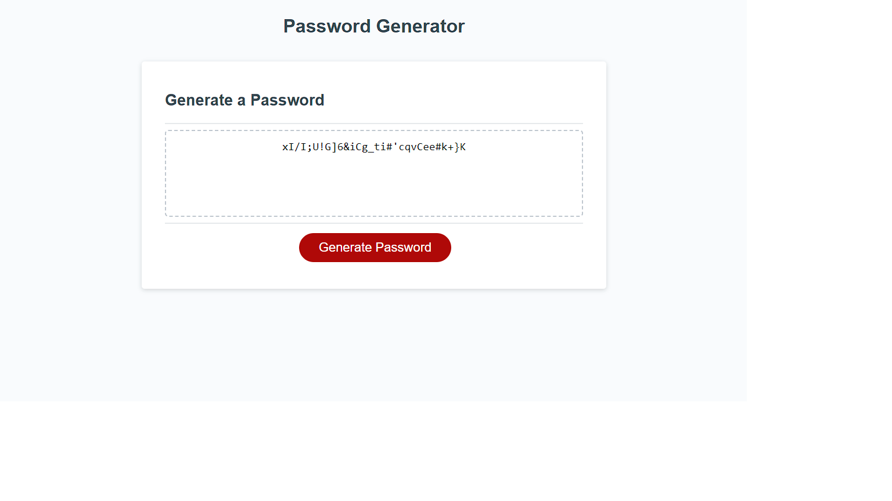
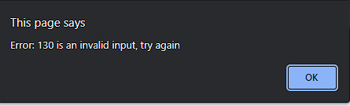
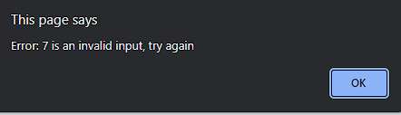
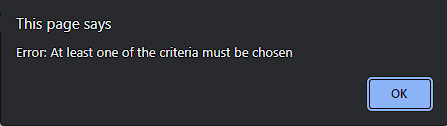

# JavaScript: Password Generator by Jeff Grasso

## Description

Coming up with secure passwords can be difficult, especially when working for a company that has strict password criteria and/or requires frequent password changes. This program is designed to generate secure passwords based on the parameters of the user's specific needs.

## Installation

N/A

## Usage
* go to https://jeffgrasso42.github.io/password-generator/
* press Generate Password button
* Enter desired password length from 8 to 128
* Select password criteria (lowercase, uppercase, number, special characters)
* get new password from password box
*

## Tests
* program will not accept a password length less than 8 or greater than 128

* length input 130 
* length input 7 

* user must select at least one of the criteria in order for the password to be generated
*

